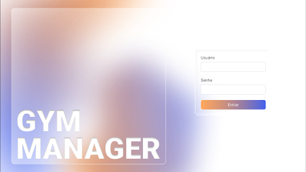
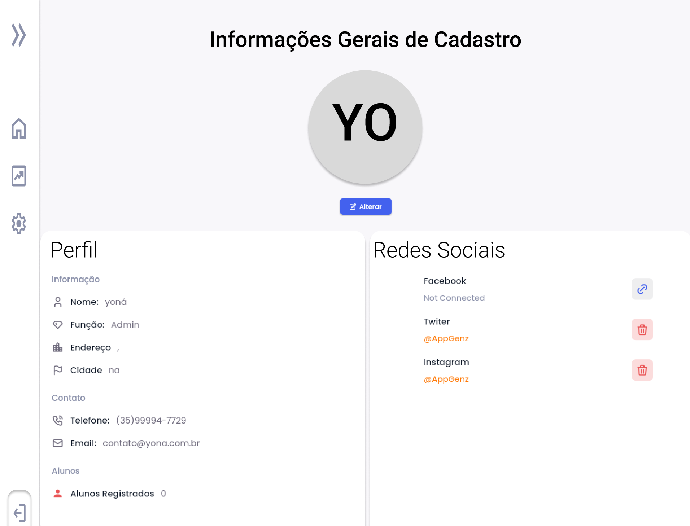
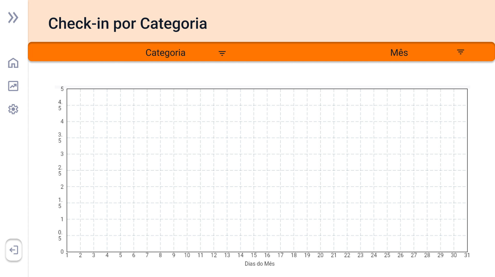

# 4. PROJETO DO DESIGN DE INTERAÇÃO

## 4.1 Personas

## 4.2 Mapa de Empatia

## 4.3 Protótipos das Interfaces
4.3 Protótipos das Interfaces — Análises Complementares
Tela de Login

1. Objetivo da Tela
A tela de login é o ponto de entrada do sistema. Seu objetivo é autenticar o usuário de forma segura e eficiente, solicitando as credenciais de acesso (usuário e senha) antes de conceder acesso à plataforma administrativa.
2. Princípios Gestálticos
Figura e fundo: A divisão da tela em dois blocos distintos, uma área visual à esquerda com gradiente e o nome do sistema, e uma área funcional à direita com os campos de entrada.
Proximidade: Os campos "Usuário" e "Senha" estão posicionados juntos, verticalmente, e o botão "Entrar" aparece logo abaixo, formando um único bloco funcional de autenticação. 
Continuidade: O fluxo de leitura segue naturalmente de cima para baixo: campo de usuário → campo de senha → botão de confirmação, respeitando a sequência lógica esperada pelo usuário.
Fechamento: O formulário ocupa um espaço delimitado no lado direito da tela, transmitindo a sensação de um bloco completo e autocontido, mesmo sem bordas explícitas em todas as direções.
3. Recomendações Ergonômicas
Campos com rótulos visíveis: Os campos "Usuário" e "Senha" possuem rótulos que identificam claramente o que deve ser preenchido, reduzindo a ambiguidade e minimizando erros de entrada.
Tamanho dos campos: Os campos de texto e o botão "Entrar" apresentam dimensões adequadas para o uso, facilitando a interação sem cliques acidentais.
Contraste e legibilidade: A área do formulário utiliza fundo claro com texto escuro, garantindo contraste suficiente para leitura confortável em diferentes condições de iluminação.
Identidade visual marcante: O uso de gradiente colorido e tipografia em caixa alta no lado esquerdo transmite modernidade, contribuindo para uma primeira impressão positiva do sistema.
4. Regras de Ouro — Shneiderman
Consistência: O botão "Entrar" segue o mesmo estilo visual (cor de destaque, formato arredondado) dos demais botões de ação primária presentes no restante do sistema. ✓ Atende
Prevenção de erros: Os campos com rótulos reduzem a chance de preenchimento incorreto. ~ Parcial
Reduzir carga de memória: O usuário não precisa memorizar instruções, a interface é autoexplicativa, com apenas dois campos e uma ação. ✓ Atende
Controle do usuário: A tela é direta e não impõe fluxos adicionais antes de permitir o acesso. ✓ Atende

Tela de Dashboard — Aulas do Dia

1. Objetivo da Tela
O Dashboard funciona como painel de controle operacional do sistema. Seu objetivo é oferecer uma visão rápida e consolidada do dia: aulas agendadas, vagas disponíveis e alunos inscritos por modalidade e horário. Serve como ponto de partida para as demais funcionalidades do sistema.
2. Princípios Gestálticos
Proximidade: Os três cartões informativos no topo ("Aulas do dia", "Faltam X aulas recorrentes", "Faltam X aulas agendadas") estão agrupados horizontalmente, sinalizando que representam indicadores do mesmo contexto temporal, o dia atual. Abaixo, a tabela de aulas forma um segundo bloco coeso de informação.
Similaridade: Os cartões no topo seguem o mesmo formato visual (bordas arredondadas, fundo branco, texto centralizado), indicando que são elementos do mesmo tipo, indicadores de resumo. A repetição do padrão cria reconhecimento.
Figura e fundo: O fundo levemente cinzento da tela contrasta com os cards brancos em primeiro plano, criando profundidade e facilitando a distinção entre plano de fundo e conteúdo relevante.
Boa continuação: A organização vertical da tela, cartões de resumo no topo, tabela de aulas logo abaixo, segue o fluxo natural de leitura, do geral para o específico: primeiro os indicadores macro, depois o detalhamento em tabela.
3. Recomendações Ergonômicas
Hierarquia da informação: A data do dia está destacada logo abaixo do título, orientando o contexto temporal da visualização. Isso evita que o usuário precise buscar a data em outro lugar do sistema.
Tabela com colunas objetivas: As colunas "Modalidade", "Horário" e "Alunos Inscritos" apresentam exatamente as informações mais consultadas por recepcionistas na rotina diária, sem excesso de dados que sobrecarregue a leitura.
Botão de ação flutuante (FAB): O botão de ação posicionado no canto inferior direito da tabela segue convenção amplamente adotada em interfaces administrativas, indicando a possibilidade de adicionar ou editar registros sem ocupar espaço fixo na tela.
Sidebar recolhida: A barra lateral em modo compacto (apenas ícones) amplia a área de conteúdo, deixando mais espaço para os dados do dia.
4. Regras de Ouro — Shneiderman
Consistência: A estrutura da tela (sidebar lateral, área de conteúdo, título de seção) é consistente com todas as demais telas do sistema. ✓ Atende
Feedback informativo: Os cartões com contagem de aulas oferecem retorno imediato sobre o estado do dia. ~ Parcial
Reduzir carga de memória: O usuário não precisa memorizar informações de outras telas, tudo o que é necessário para conduzir a recepção do dia está centralizado nessa tela. ✓ Atende
Controle do usuário: A navegação lateral permite acesso rápido a qualquer seção do sistema a partir desta tela. ✓ Atende

Tela de Informações Gerais dos Treinos

1. Objetivo da Tela
Tela administrativa para gerenciar as modalidades de treino e os instrutores cadastrados no sistema. Permite adicionar, editar e excluir registros em dois painéis paralelos (Modalidades e Instrutores), otimizando o fluxo de configuração da plataforma por parte dos administradores.
2. Princípios Gestálticos
Proximidade: Os itens de cada lista (Modalidades e Instrutores) são agrupados dentro de painéis claramente delimitados por cards, indicando pertencimento ao mesmo contexto funcional. 
Similaridade: Os ícones de edição e exclusão são repetidos uniformemente em cada linha, sinalizando as mesmas operações disponíveis para todos os registros. 
Figura e fundo: Os cartões brancos se destacam sobre o fundo cinza claro da página, criando contraste suficiente para delimitar as áreas funcionais. 
Boa continuação: A disposição lado a lado dos dois painéis sugere paralelismo funcional, guiando o olhar horizontalmente e facilitando a comparação. 
3. Recomendações Ergonômicas
Confirmação de exclusão: A ação de excluir (ícone lixeira) é irreversível e direta. Deve haver um diálogo de confirmação antes da execução. 
Acessibilidade dos ícones: Ícones sem rótulo textual prejudicam usuários com deficiência visual ou baixa familiaridade com o sistema. Recomenda-se adicionar tooltip ou aria-label. 
Hierarquia visual: O título 'Informações Gerais dos Treinos' está centralizado mas sem hierarquia visual clara em relação aos subtítulos dos painéis. Recomenda-se aumentar o contraste tipográfico entre níveis. 
4. Regras de Ouro — Shneiderman
 Controle do usuário: Estrutura clara com duas seções independentes e controláveis: ~ Parcial 
  Reduzir carga de memória: Ícones visuais identificáveis, estrutura simples e previsível: ✓ Atende 

AGENDAR TREINO - TREINO AGENDADO

1. Objetivo da Tela

Modal de agendamento de treino avulso com data específica. Permite ao gestor definir o horário de início, duração, número de vagas, modalidade e instrutor do treino, além de selecionar o dia exato por meio de um calendário interativo. A aba ativa e Treino agendado, diferenciando-se da opção de recorrência semanal.

2. Principios Gestalticos

Proximidade: Os campos de formulário (Início, Duração, Número de vagas, Modalidade, Instrutor) estão organizados em pares label-input alinhados, agrupando visualmente cada informação solicitada.
Similaridade: Os campos de texto e os dropdowns compartilham a mesma estrutura visual com linha inferior cinza, criando um padrão uniforme que reduz o esforço de interpretação do usuário.
Figura e fundo: O cabeçalho azul com ícone e título branco destaca-se como figura principal, estabelecendo o contexto da ação antes mesmo da leitura do formulário.
Continuação: O calendário apresenta os dias da semana em sequência horizontal e as semanas em progressão vertical, guiando o olhar de forma natural da esquerda para a direita e de cima para baixo.
Fechamento: O modal é delimitado por bordas claras e botões de ação no rodapé, criando a percepção de um fluxo completo com início, meio e fim bem definidos.

3. Recomendações Ergonômicas

Calendário integrado ao formulário: A inserção do calendário diretamente no modal, sem necessidade de abrir um componente separado, é uma decisão ergonômica excelente. O usuário visualiza e seleciona a data no mesmo contexto do agendamento, sem perder o fio da tarefa.
Destaque do dia atual: O uso do círculo laranja para marcar o dia corrente no calendário é uma referência temporal imediata e intuitiva, orientando o usuário no tempo sem necessidade de consultar uma fonte externa.
Navegação por abas: A separação entre Treino recorrente e Treino agendado por meio de abas é uma solução ergonômica eficiente, pois permite ao usuário alternar entre os dois modos de agendamento sem sair do modal ou perder os dados já inseridos.
Botões de ação com diferenciação visual: O uso de cinza para Cancelar e azul para Confirmar cria uma hierarquia visual clara entre a ação secundária e a ação principal, reduzindo o risco de cliques acidentais em ações indesejadas.

4. Regras de Ouro de Shneiderman

Consistência: Atende. Cabeçalho azul, campos com linha inferior e estrutura label-input são consistentes com o padrão visual do sistema.
Diálogos com conclusão: Parcial. Os botões Cancelar e Confirmar encerram o fluxo, mas não há confirmação explícita após o agendamento ser realizado.
Reversão de ações: Parcial. O botão Cancelar permite abortar a ação, mas não a desfazer após confirmação.
Controle do usuário: Atende. O usuário tem controle sobre todos os parâmetros do treino e pode cancelar a qualquer momento.
Reduzir carga de memória: Atende. O calendário visual elimina a necessidade de digitar datas manualmente; dropdowns de modalidade e instrutor evitam erros de digitação.

AGENDAR TREINO - TREINO RECORRENTE

1. Objetivo da Tela

Modal de agendamento de treino com recorrência semanal. Compartilha os mesmos campos de configuração da Tela 5 (horário, duração, vagas, modalidade, instrutor), substituindo o calendário por checkboxes dos dias da semana. Permite ao gestor criar treinos que se repetem automaticamente nos dias selecionados.

2. Principios Gestalticos

Proximidade: Os checkboxes dos dias da semana estão organizados em uma grade de três colunas, agrupando os dias de forma compacta e simétrica, facilitando a seleção múltipla.
Similaridade: Todos os checkboxes possuem o mesmo tamanho, rótulo e alinhamento, comunicando que representam opções equivalentes dentro do mesmo conjunto de escolha.
Continuação: A leitura dos dias da semana segue a ordem convencional de segunda a domingo, respeitando o modelo mental do usuário e reduzindo o esforço de localização.
Figura e fundo: O cabeçalho azul mantém a mesma identidade visual da Tela 5, reafirmando o contexto da ação de agendamento e criando continuidade entre as duas abas.
Fechamento: A grade de checkboxes forma um bloco visual coeso que o usuário percebe como uma unidade de seleção completa, mesmo antes de interagir com ela.

3. Recomendações Ergonômicas

Checkboxes para seleção múltipla de dias: O uso de checkboxes para os dias da semana e a escolha ergonômica correta para esse contexto, pois permite ao usuário selecionar simultaneamente quantos dias desejar sem restrição, refletindo com precisão a natureza da recorrência de treinos.
Grade de três colunas para os dias: A organização dos sete dias em uma grade compacta de três colunas é uma solução especialmente eficiente, que evita uma lista vertical longa e mantém o modal em tamanho razoável.
Reaproveitamento da estrutura da Tela 5: Manter os mesmos campos de configuração (horário, duração, vagas, modalidade, instrutor) nas duas abas e uma decisão ergonômica inteligente, pois o usuário que alterna entre os modos não precisa reaprender a interface.
Clareza da separação entre abas: A aba ativa (Treino recorrente) é indicada pela linha laranja inferior e pelo texto em preto, enquanto a aba inativa aparece em cinza, criando uma diferenciação ergonômica eficaz que orienta o usuário sobre em qual modo está trabalhando.

4. Regras de Ouro de Shneiderman

Consistência: Atende. Estrutura do formulário, cabeçalho, botões e estilo visual idênticos à Tela 5, garantindo coerência entre as duas abas do mesmo modal.
Diálogos com conclusão: Parcial. Botões Cancelar e Confirmar estão presentes, mas sem resumo do agendamento recorrente antes da confirmação final.
Reversão de ações: Parcial. O botão Cancelar permite sair sem salvar, mas não há que desfazer após a confirmação da recorrência.
Controle do usuário: Atende. O usuário tem liberdade total para selecionar qualquer combinação de dias e pode cancelar a qualquer momento.
Reduzir carga de memória: Atende. Os dias da semana listados por extenso eliminam a necessidade de memorizar abreviações ou códigos; os checkboxes tornam o estado de seleção sempre visível.

Menu Lateral de Navegação

1. Objetivo da Tela
O menu lateral é o elemento de navegação global do sistema. Seu objetivo é permitir que o usuário acesse qualquer seção da plataforma de forma rápida e organizada, a partir de qualquer tela. Quando expandido, exibe o logotipo do sistema, os grupos de navegação e o botão de logout. Quando recolhido, exibe apenas ícones, liberando espaço para o conteúdo principal.
2. Princípios Gestálticos
Proximidade: Os itens de navegação são organizados em três grupos funcionais bem delimitados: Dashboard (Alunos, Treinos, Histórico e Relatórios, Monitores Cardíacos), Análise de Dados (Check-in por Categoria, Check-in por Dia) e Configurações (Editar Cadastro, Editar Treinos). A proximidade entre os subitens de cada grupo sinaliza pertencimento à mesma categoria funcional.
Similaridade: Todos os itens de navegação seguem o mesmo formato visual (ícone + rótulo textual) criando uniformidade e previsibilidade na interação. O item ativo é destacado visualmente (cor diferenciada), reforçando a noção de estado atual.
Figura e fundo: O menu lateral se destaca do conteúdo principal por ocupar uma faixa vertical distinta, com identidade visual própria. O logotipo no topo ancora a identidade da marca dentro da navegação.
Fechamento: Os grupos de navegação são percebidos como blocos completos, mesmo sem delimitadores explícitos entre eles, graças ao espaçamento e à indentação dos subitens.
3. Recomendações Ergonômicas
Menu recolhível: A possibilidade de recolher o menu (botão "«") amplia a área de trabalho do usuário em telas menores, uma decisão ergonômica importante para uso em notebooks e tablets.
Hierarquia clara entre itens e subitens: Os grupos de nível superior (Dashboard, Análise de Dados, Configurações) funcionam como categorias, enquanto os subitens são as páginas específicas. Essa hierarquia de dois níveis é suficiente para o escopo do sistema, evitando menus excessivamente profundos.
Botão "Sair" isolado: O item de logout está posicionado na parte inferior do menu, separado dos demais itens de navegação. Esse isolamento reduz o risco de logout acidental e segue convenção amplamente adotada em sistemas web.
Indicação do item ativo: Destacar visualmente o item de menu correspondente à tela atual orienta o usuário sobre sua localização no sistema, reduzindo desorientação durante a navegação.
4. Regras de Ouro — Shneiderman
Consistência: O menu está presente em todas as telas com a mesma estrutura e posicionamento, garantindo que o usuário sempre saiba como navegar. ✓ Atende
Controle e liberdade do usuário: O acesso direto a qualquer seção a partir de qualquer tela dá ao usuário plena liberdade de navegação. ✓ Atende
Feedback informativo: O destaque do item ativo informa ao usuário onde ele se encontra no sistema a qualquer momento. ✓ Atende

Tela de Informações Gerais de Cadastro (Perfil)

1. Objetivo da Tela
A tela de Informações Gerais de Cadastro exibe o perfil completo do usuário logado no sistema. Seu objetivo é centralizar os dados pessoais e de contato do administrador ou instrutor, permitindo visualizar e editar informações como nome, função, endereço, telefone, e-mail e redes sociais vinculadas. A tela também exibe a quantidade de alunos registrados pelo usuário.
2. Princípios Gestálticos
Proximidade: As informações são organizadas em blocos semanticamente coesos: Perfil (dados pessoais), Redes Sociais (vínculos externos) e Contato (meios de comunicação). A proximidade entre os campos de cada bloco facilita a leitura e a localização de informações específicas.
Similaridade: Os campos de texto dentro de cada seção seguem o mesmo padrão visual, com ícones à esquerda e valores à direita. Os botões de ação (editar/excluir) nas redes sociais são repetidos uniformemente, sinalizando as mesmas operações disponíveis para cada vínculo.
Figura e fundo: O avatar circular com as iniciais do usuário ("YO") no centro da tela funciona como elemento de destaque visual (figura), ancorando a identidade do perfil em um elemento reconhecível antes mesmo da leitura dos dados textuais.
Fechamento: As seções delimitadas por títulos ("Perfil", "Redes Sociais", "Contato") criam blocos perceptualmente completos, mesmo sem bordas entre eles, graças ao espaçamento e à hierarquia tipográfica.
3. Recomendações Ergonômicas
Avatar com ação de alteração: O botão "Alterar" posicionado abaixo do avatar permite que o usuário identifique imediatamente como personalizar sua foto de perfil, sem necessidade de explorar menus adicionais.
Organização em duas colunas: A divisão da tela entre "Perfil" (esquerda) e "Redes Sociais" (direita) aproveita bem o espaço horizontal disponível, evitando que a tela fique excessivamente longa em rolagem vertical.
Ícones de contexto: O uso de ícones ao lado de cada campo (ícone de pessoa, coração, endereço, cidade) facilita a identificação rápida do tipo de dado sem depender exclusivamente da leitura do rótulo textual.
Dados de contato em destaque: As informações de telefone e e-mail aparecem em uma seção própria ("Contato"), separadas dos dados cadastrais, o que reflete a diferença de uso entre esses dois tipos de informação na rotina do sistema.
4. Regras de Ouro — Shneiderman
Consistência: A estrutura da tela, a navegação lateral e os padrões visuais de botões e ícones são consistentes com o restante do sistema. ✓ Atende
Controle do usuário: O usuário pode editar suas informações e gerenciar vínculos com redes sociais de forma independente. ✓ Atende
Reduzir carga de memória: Todos os dados estão visíveis na mesma tela, sem necessidade de navegar entre abas ou subseções para consultar informações do perfil. ✓ Atende

Tela de Check-in por Dia

1. Objetivo da Tela
Tela de análise com gráfico de linha exibindo a frequência de check-ins por categoria ao longo dos dias do mês. Permite filtrar por Categoria e Mês, oferecendo ao gestor uma visão temporal do engajamento dos alunos por modalidade.
2. Princípios Gestálticos
Figura e fundo:O fundo em laranja claro (header) e a barra de filtro laranja saturada criam uma hierarquia visual onde o fundo laranja pastel funciona como zona de título e a barra escura delimita a área de controle.
Continuação: O eixo X com numeração dos dias guia o olhar da esquerda para a direita, reforçando a percepção temporal do gráfico. 
Proximidade: Os filtros 'Categoria' e 'Mês' estão agrupados na mesma barra, indicando que ambos pertencem ao mesmo contexto de filtragem. 
Fechamento: O gráfico está dentro de uma área delimitada por eixos e grid, criando a percepção de um espaço completo mesmo sem dados preenchidos. 
3. Recomendações Ergonômicas
Gráfico como representação principal: A escolha de um gráfico de linha para representar check-ins ao longo dos dias do mês é ergonomicamente acertada, pois transmite tendências e variações de forma intuitiva, facilitando a interpretação sem necessidade de leitura de tabelas numéricas.
Filtros posicionados no topo: A barra de filtros (Categoria e Mês) está posicionada de forma estratégica, antes do gráfico, seguindo o fluxo natural de leitura. O usuário primeiro define o contexto e depois visualiza os dados.
Eixo X com dias do mês: A numeração sequencial dos dias no eixo horizontal e uma referência temporal imediata e de fácil compreensão, não exigindo aprendizado prévio para interpretação do gráfico.
Destaque cromático do cabeçalho: O uso de cor no cabeçalho da tela diferencia visualmente a área de título da área de conteúdo, criando uma separação clara entre contexto e dado.
4. Regras de Ouro — Shneiderman
 Consistência: Navegação lateral e estrutura geral consistente com demais telas: ✓ Atende 
  Atalhos para usuários experientes: Filtros disponíveis, mas sem exportação de dados identificada: ~ Parcial 
  Diálogos com conclusão: Não aplicável a esta tela de visualização: ~ Parcial 
  Reversão de ações: Filtros podem ser revertidos manualmente: ~ Parcial 
  Controle do usuário: Dois filtros disponíveis; usuário tem controle básico sobre a visualização: ~ Parcial

 Tela de Gerenciamento de Alunos 

1. Objetivo da Tela 

Tela de listagem tabular dos alunos cadastrados no sistema, exibindo colunas de nome, telefone, plano, status (Ativo/Inativo), token FCM e ações individuais. Destina-se a coordenadores e administradores que precisam monitorar e gerenciar o cadastro de alunos.
 
2. Princípios Gestálticos 

Proximidade: As colunas agrupam atributos relacionados ao mesmo aluno em uma única linha, facilitando a leitura horizontal e a associação dos dados. 
Similaridade: Os ícones de ação são idênticos em todas as linhas, sinalizando operações consistentes. Os badges de status seguem padrão cromático fixo: verde para 'Ativo' e rosa/vermelho para 'Inativo'. 
Boa continuação: As linhas verticais que delimitam as colunas guiam o olhar de cima a baixo, mantendo uma leitura organizada e fluida. 
Figura e fundo: O cabeçalho diferencia-se do corpo da tabela, e os badges coloridos destacam-se como figura sobre o fundo neutro das células. 

3. Recomendações Ergonômicas 

Uso de tabela para listagem: A escolha do formato tabular para exibir os dados dos alunos é ergonomicamente adequada, pois permite varredura rápida por linha e cooperação eficiente entre registros.
Badges de status visuais: A utilização de badges coloridos para indicar Ativo e Inativo é uma solução ergonômica inteligente, pois permite ao usuário identificar o estado do aluno de forma imediata, sem necessidade de leitura textual detalhada.
Coluna de ações fixada a direita: Posicionar a coluna de ações sempre na última posição e uma convenção consolidada que os usuários já esperam, reduzindo o tempo de busca visual e o risco de acionamentos acidentais.
Cabeçalho fixo e claro: Os rótulos das colunas são objetivos e facilitam a orientação do usuário dentro da tabela, contribuindo para uma navegação eficiente mesmo em listas extensas.

4. Regras de Ouro — Shneiderman 

 Consistência: Estrutura visual repetida entre linhas, paleta de cores estável: ✓ Atende 
 Controle do usuário: Navegação lateral disponível, mas sem filtros na listagem: ~ Parcial 
 Reduzir carga de memória: Badges coloridos tornam o status imediatamente identificável: ✓ Atende 

Tela de Histórico e Relatórios 

1. Objetivo da Tela 

Tela administrativa de consulta histórica de alunos, exibindo nome, telefone, data do último check-in e status. Oferece filtro por status (Todos/Ativos/Inativos), botão de exportação e acesso ao histórico completo. Destina-se a gestores que precisam auditar a frequência e atividade dos alunos. 

2. Princípios Gestálticos 

Proximidade: Os filtros de status (Todos alunos / Ativos / Inativos) são agrupados em um popover próximo ao título, indicando sua relação com a listagem exibida. 
Similaridade: Os badges de status seguem o mesmo padrão cromático das demais telas (verde para Ativo, rosa para Inativo), mantendo coerência visual no sistema. 
Figura e fundo: Os botões 'Histórico' e 'Exportar' destacam-se como elementos de ação sobre o fundo branco, diferenciando-se visualmente da tabela de dados. 
Boa continuação: As colunas da tabela guiam o olhar horizontalmente, e a hierarquia de filtros posicionada no canto superior direito orienta o fluxo de uso da tela. 

3. Recomendações Ergonômicas 

Botão de exportação disponível: A presença do botão Exportar é uma decisão ergonômica de alto valor, pois permite ao gestor levar os dados para fora do sistema de forma rápida, atendendo necessidades de relatórios externos sem esforço adicional.
Filtro de status acessível: O mecanismo de filtragem rápida por status (Todos, Ativos, Inativos) é ergonomicamente eficiente, pois reduz a quantidade de informação exibida de acordo com o foco do usuário, diminuindo a carga cognitiva na leitura da lista.
Coluna de último check-in: A inclusão da data do último check-in como dado central da tabela é uma escolha ergonômica precisa, pois responde diretamente a pergunta mais frequente de um gestor ao consultar histórico: quando foi a última vez que o aluno compareceu.
Botão de histórico no cabeçalho: Disponibilizar o acesso ao histórico diretamente na barra superior da tela e uma prática que respeita o fluxo de trabalho do usuário, oferecendo atalho para a função mais relevante sem exigir navegação adicional.. 

4. Regras de Ouro — Shneiderman 

 Consistência: Badges, navegação lateral e estrutura tabular consistentes com o restante do sistema: ✓ Atende 
 Atalhos para usuários experientes: Filtros rápidos por status disponíveis; exportação presente: ~ Parcial 
 Prevenção de erros: Filtros com rádio buttons previnem seleções múltiplas conflitantes: ~ Parcial 
 Reversão de ações: Filtros reversíveis; sem desfazer para exportação: ~ Parcial 
 Controle do usuário: Usuário controla o filtro de status e pode exportar dados: ✓ Atende 
 Reduzir carga de memória: Filtros visíveis reduzem necessidade de memorização; badges visuais auxiliam: ✓ Atende 

## 4.4 Testes com Protótipos
O Gym Manager foi projetado como uma ferramenta de backoffice, destinada exclusivamente ao uso interno pelos funcionários autorizados da acadSimemia. Dessa forma, o sistema não contempla funcionalidades de autoatendimento para alunos nem processamento automático de pagamentos, concentrando-se na organização administrativa e no suporte às atividades de gestão.

Além do desenvolvimento funcional do sistema, também foram realizadas avaliações de usabilidade e comunicabilidade com diferentes perfis de usuários, como dono da academia (Vinícius Boreaux) , recepcionista (Gleidson de Oliveira Silva) e personal trainer (Vanessa Pereira Gomes). Essas avaliações tiveram como objetivo analisar a clareza da interface, a facilidade de navegação e a eficiência das funcionalidades propostas, contribuindo para a construção de uma solução mais intuitiva, organizada e adequada às necessidades do ambiente.Segue as perguntas e respostas para melhor análise:

1. Ao acessar a página inicial, você conseguiu entender rapidamente qual é o propósito ou objetivo principal do site?
   
Vinicius - Sim. Logo na página inicial consegui perceber que o sistema é voltado para gestão administrativa da academia, principalmente controle de funcionários, turmas e relatórios.

Gelidson - Sim. Entendi rapidamente que o sistema serve para organizar as informações da academia e auxiliar nas tarefas administrativas.

Vanessa - Ficou claro que o sistema é voltado para administração das aulas e turmas da academia.

2. O menu e os botões estavam posicionados de forma intuitiva?
   
Vinicius - Sim. Os menus principais estavam organizados de forma lógica e os botões em locais esperados, facilitando a navegação.

Gleidson - Sim. Os menus e botões estavam fáceis de encontrar e acessar durante a navegação.

Vanessa - Sim. O posicionamento dos menus facilitou bastante a navegação.

3. A nomenclatura das seções (menus, botões, links) fez sentido para você?
   
Vinicius - Sim. Os nomes utilizados como “Instrutores”, “Modalidades”, “Turmas” e “Relatórios” fazem sentido para o contexto da academia.

Gleidson - Sim. A nomenclatura utilizada foi simples e fácil de compreender.

Vanessa- Fizeram sentido sim, os nomes das seções foram bem escolhidos e são compatíveis com a rotina da academia.

4. Você conseguiu encontrar facilmente as seções ou informações que procurava no protótipo?
 
Vinicius - Sim. Consegui localizar rapidamente as áreas que precisava acessar, principalmente os dashboards e relatórios gerenciais.

Gleidson - Sim. Consegui encontrar facilmente as seções relacionadas às turmas, aulas e cadastro de instrutores.

Vanessa - Foi fácil localizar informações relacionadas às aulas e modalidades.

5. As etapas apresentadas para realizar as tarefas estavam claras e seguiam uma lógica compreensível?
   
Vinicius - Sim. O fluxo das tarefas aparenta seguir uma ordem lógica, especialmente nos processos de cadastro e gerenciamento.

Gleidson - Sim. As etapas estavam claras e bem organizadas, sem causar confusão.

Vanessa - Sim. 

6. Os elementos visuais (cores, ícones e disposição dos botões) facilitaram a identificação do que era clicável e do que era apenas informativo?
   
Vinicius - Sim. Os elementos visuais ajudaram bastante a identificar ações importantes e distinguir informações apenas informativas.

Gleidson - Sim. As cores e ícones ajudaram bastante a identificar o que podia ser clicado, só faltou uma descrição quando passava o mouse por cima.

Vanessa - Os botões e ícones estavam bem destacados e facilitaram a interação.

7. Há elementos visuais que chamam atenção indevidamente ou confundem?

Vinicius - Não encontrei elementos muito confusos, porém alguns destaques visuais poderiam ser mais discretos para evitar excesso de informação na tela inicial.

Gleidson - Não muito. Apenas alguns ícones poderiam ter descrição ao passar o mouse para evitar dúvidas.

Vanessa - Não identifiquei elementos muito confusos, mas algumas telas poderiam ter menos informações simultâneas para evitar poluição visual.

8. Os textos e rótulos utilizados nas páginas estavam claros e ajudaram a entender as ações que você podia realizar?

Vinicius - Sim. Os textos estavam claros e objetivos, ajudando no entendimento das funcionalidades disponíveis.

Gleidson - Muito claros. Os textos ajudaram bastante a entender quais ações poderiam ser realizadas.

Vanessa - Os textos estavam claros e ajudaram a entender rapidamente as funcionalidades.

9. Houve algum elemento difícil de visualizar, clicar ou compreender durante a navegação (por tamanho, contraste ou formato)?
    
Vinicius - Em geral não. Apenas alguns botões secundários poderiam ter tamanho um pouco maior para facilitar o clique.

Gleidson - Alguns campos de formulário pareceram pequenos, principalmente na dashboard

Vanessa - Não tive grandes dificuldades, mas alguns contrastes de cores poderiam ser melhorados para facilitar a leitura, usaram muitas cores claras demais.

10. O texto das instruções, rótulos e mensagens é claro e compreensível?

Vinicius - Sim. As instruções e mensagens estavam compreensíveis e adequadas ao ambiente administrativo.

Gleidson - Sim, as mensagens e instruções estavam objetivas e fáceis de entender.

Vanessa - As instruções e mensagens foram claras durante a navegação.

11. Encontrou termos técnicos ou expressões confusas?

Vinicius - Não. Os termos utilizados são familiares para quem administra uma academia.

Gleidson - Não encontrei termos difíceis. A linguagem está adequada para uso diário.

Vanessa - Os termos utilizados são comuns para quem trabalha em academia.

12. Você se sentiu confiante e satisfeito ao interagir com o protótipo, sem necessidade de ajuda externa?

Vinicius - Sim. Me senti confortável utilizando o protótipo sem precisar de auxílio externo.

Gleidson - Sim. Consegui navegar no sistema com facilidade.

Vanessa - Sim. Me senti confiante utilizando o sistema sem necessidade de treinamento.

13. O que você mais gostou na interface?

Vinicius - Gostei principalmente da organização do dashboard e da centralização das informações importantes do negócio.

Gleidson - Gosto da simplicidade da interface e da facilidade para acessar as informações rapidamente.

Vanessa - Da organização das informações das turmas e da facilidade de gerenciamento das aulas.

14. O que você mudaria ou melhoraria?

Vinicius - Melhoraria a visualização dos relatórios com gráficos mais detalhados e filtros mais avançados.

Gleidson - Eu adicionaria atalhos rápidos para tarefas frequentes, como cadastro de turmas e consulta de aulas.

Vanessa - Melhoraria a visualização do cronograma das aulas, talvez utilizando um calendário mais interativo.

15. Tem algo mais que gostaria de comentar sobre os protótipos?

Vinicius -É muito útil para substituir controles em planilhas e melhorar a gestão diária da academia.

Gleidson - O sistema parece prático para o trabalho da recepção e pode reduzir bastante o uso de papel e planilhas.

Vanessa - Demonstra potencial para melhorar bastante a organização interna para os funcionários da academia.

